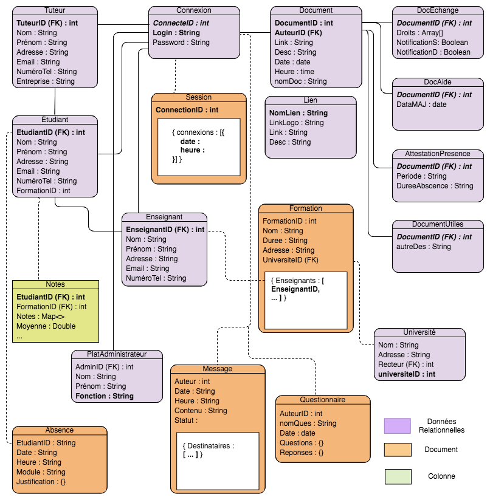

# BenchmarkDB

Dans le cadre de l’UE : SQL, noSQL et newSQL, dispensée pour les étudiants de M2 Informatique pour la finance en apprentissage à Paris-Dauphine. 

Il s'agit de mettre en place un multi-modèle de données. Ce modèle devra mélanger des données relationnelles, ainsi que des données clé-valeur, colonne, document et graphe. Et cela dans le but de gérer l’accès aux données d’une application similaire à l’application ELIA.

 

  

